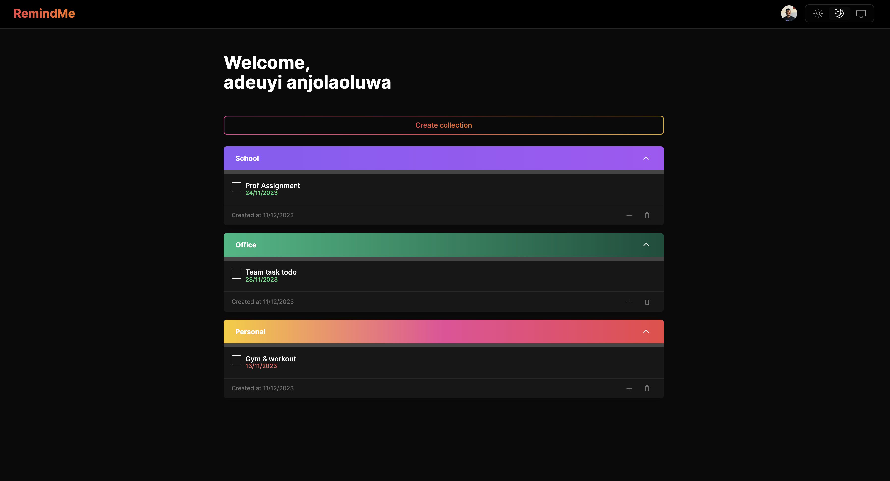
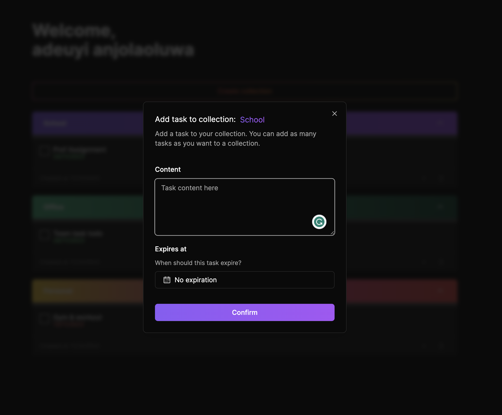

# Reminder Application - NextJS 14, Prisma, Clerk, Zod & Typescript

## A Fullstack reminder application

Live on https://reminder-app-fullstack.vercel.app/

**Reminder App View**




## Getting Started

First, run the development server:

```bash
npm run dev
# or
yarn dev
# or
pnpm dev
# or
bun dev
```

Open [http://localhost:3000](http://localhost:3000) with your browser to see the result.

## To Setup Clerk
run
```bash
npm install @clerk/nextjs
```